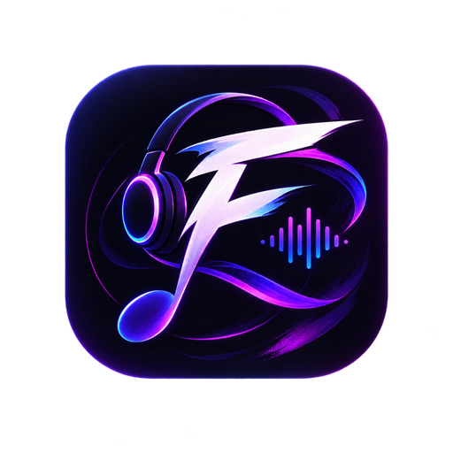

<div align="center">



# 🎵 Fiend

### A modern, feature-packed YouTube Music client for Android
Developed and Maintained by **Dhruv Saraswat** ([Eurt-labs](https://github.com/Eurt-labs))

<br/>

[](https://github.com/Eurt-labs/Fiend/releases)
[](https://github.com/Eurt-labs/Fiend/blob/main/LICENSE)
[](https://github.com/Eurt-labs/Fiend/stargazers)

<br/>

[**Features**](#-features) · [**Architecture**](#-architecture) · [**Building from Source**](#-building-from-source) · [**Credits & Acknowledgements**](#-credits--acknowledgements)

</div>

---

## ✨ Features

<table>
  <tr>
    <td width="50%" valign="top">

#### 🎧 Playback Engine
- Stream any song, video, or playlist directly from YouTube Music
- Background audio playback with media notification & lockscreen controls
- Smart caching & local offline download manager
- Silence skipping, audio normalization, and sleep timer
- Audio pitch & tempo controls (varispeed)
- Built-in 5-band audio equalizer

</td>
    <td width="50%" valign="top">

#### 🎨 Material 3 Expressive UI
- Dynamic Material You / MaterialKolor theming
- Pure Black (OLED) mode and customizable accent palettes
- Customizable player background styles (Blur, Gradient, Solid)
- Modern Mini-Player with swipe gestures
- High refresh rate display support (90Hz / 120Hz)

</td>
  </tr>
  <tr>
    <td width="50%" valign="top">

#### 📜 Lyrics & Discovery
- Live synchronized word-by-word scrolling lyrics
- Multi-source lyrics (LRCLIB, Kugou, Paxsenix)
- AI-powered live lyric translation & romanization
- Built-in audio music recognizer
- Personalized Quick Picks, Forgotten Favorites & Daily Discover

</td>
    <td width="50%" valign="top">

#### 📚 Library & Integrations
- Local & synced playlist management
- YouTube Music account login & cloud sync
- Last.fm scrobbling & like sync
- Discord Rich Presence integration
- Listen Together synchronized group listening
- CSV playlist import & export

</td>
  </tr>
</table>

---

## 🛠️ Architecture

Fiend is structured as a multi-module Android project built with modern Android standards:

```
Fiend/
├── app/                  # Main Android application module
│   ├── src/main/kotlin/  # Jetpack Compose UI, ViewModels, Media3 Playback Service, Room DB
│   └── src/main/res/     # Material drawables, layouts, localized resources
├── innertube/            # YouTube Music InnerTube API Client library module
│   └── src/main/kotlin/  # Ktor client, InnerTube endpoint models & parsers
├── gradle/               # Version catalog (libs.versions.toml) and wrapper
├── build.gradle.kts      # Top-level build configuration
└── settings.gradle.kts   # Gradle settings and module registry
```

### Tech Stack & Libraries
- **Language**: Kotlin (2.4+)
- **UI Toolkit**: Jetpack Compose, Material 3 Expressive, MaterialKolor
- **Audio Engine**: AndroidX Media3 (ExoPlayer), MediaSessionService, CacheDataSource
- **Networking**: Ktor 3, Kotlinx Serialization, OkHttp
- **Database & Storage**: AndroidX Room, DataStore Preferences, Protocol Buffers
- **Dependency Injection**: Google Dagger Hilt
- **Image Loading**: Coil 3 Compose

---

## 🏗️ Building from Source

### Prerequisites
- Android Studio Ladybug or later
- JDK 17+ (or JDK 21+)
- Android SDK Platform 36/37, Build-Tools, and NDK

### Build Commands

```bash
# Clone the repository
git clone https://github.com/Eurt-labs/Fiend.git
cd Fiend

# Build FOSS debug APK
./gradlew :app:assembleFossDebug

# Build Release APK
./gradlew :app:assembleFossRelease
```

The compiled APK will be located at:
`app/build/outputs/apk/universalFoss/debug/app-universal-foss-debug.apk`

---

## 📜 Credits & Acknowledgements

- **Dhruv Saraswat** ([Eurt-labs](https://github.com/Eurt-labs)) — Creator & Lead Developer of Fiend
- **InnerTune & ViMusic** — Pioneer open-source YTM implementations
- **LRCLIB & Paxsenix** — Lyric provider APIs

---

## 📄 License

Fiend is free and open-source software licensed under the **GNU General Public License v3.0** (GPL-3.0). See [LICENSE](LICENSE) for details.
