# 🎵 Fiend — Application Architecture Documentation

> **Developed by Dhruv Saraswat** | [Eurt-labs/Fiend](https://github.com/Eurt-labs/Fiend)  
> A modern, feature-packed YouTube Music client for Android

---

## Table of Contents

1. [Application Overview](#application-overview)
2. [Architecture Pattern](#architecture-pattern)
3. [Tech Stack](#tech-stack)
4. [Module Structure](#module-structure)
5. [File Structure](#file-structure)
6. [Data Flow — How It All Works](#data-flow)
7. [App Launch Flowchart](#app-launch-flowchart)
8. [Playback Workflow](#playback-workflow)
9. [InnerTube API Pipeline](#innertube-api-pipeline)
10. [Lyrics Pipeline](#lyrics-pipeline)
11. [UI Component Hierarchy](#ui-component-hierarchy)
12. [Database Schema (Room)](#database-schema)
13. [Dependency Injection (Hilt)](#dependency-injection)
14. [Build Flavors](#build-flavors)

---

## Application Overview

Fiend is an **unofficial, open-source YouTube Music client** for Android. It does not use any Google/YouTube official APIs — instead, it reverse-engineers the **YouTube InnerTube API** (a private internal API that the official YouTube clients use) to fetch music content, stream audio, search, manage playlists, and more — all without requiring a Google account.

| Property | Value |
|---|---|
| **App ID** | `com.fiend.music` |
| **Namespace** | `com.fiend.music` |
| **Minimum SDK** | Android 6.0 (API 23) |
| **Target SDK** | Android 16 |
| **Language** | Kotlin 2.4.10 |
| **UI Framework** | Jetpack Compose 1.12.0 |
| **Design System** | Material 3 Expressive |

---

## Architecture Pattern

Fiend follows **Multi-Module Clean Architecture** with **MVVM** (Model-View-ViewModel).

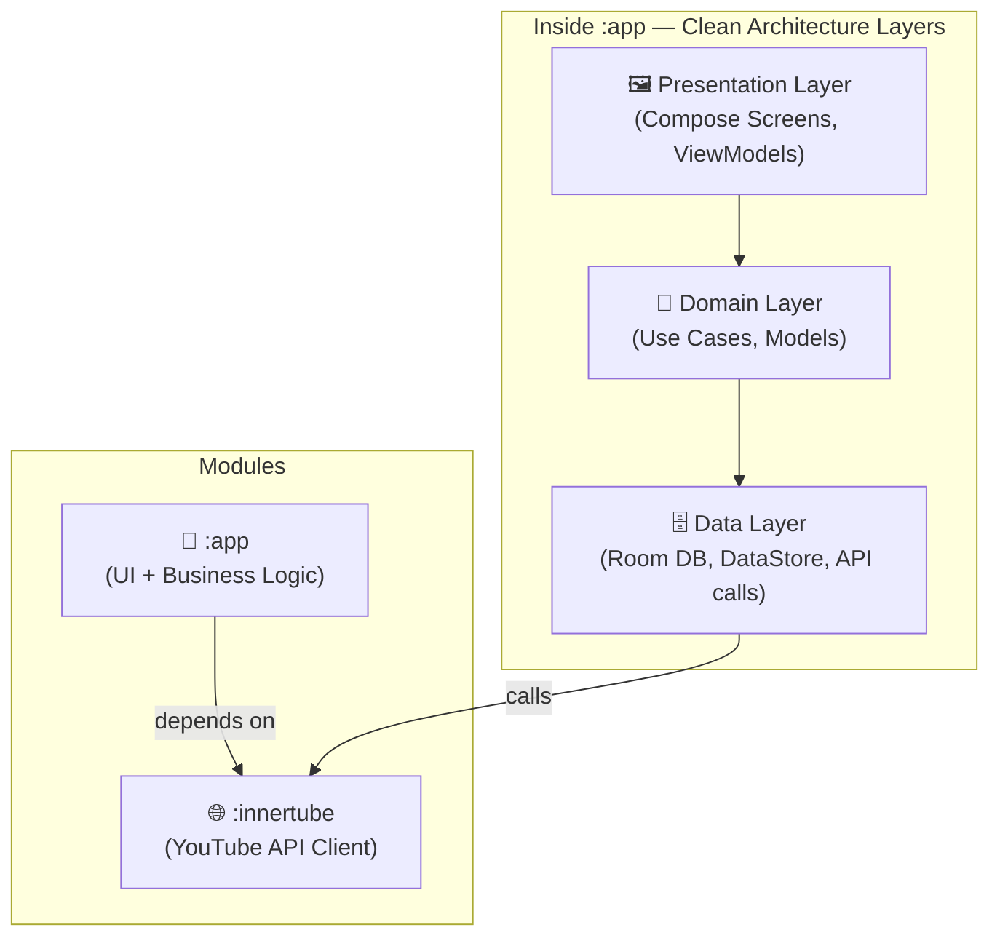

**Why multi-module?**  
- `:innertube` is a completely self-contained YouTube API client that could theoretically be used independently in any project. This separation ensures clean boundaries and faster incremental builds.
- `:app` contains all Android-specific code (UI, background service, database, DI).

---

## Tech Stack

| Category | Library | Version | Purpose |
|---|---|---|---|
| **Language** | Kotlin | 2.4.10 | Primary language |
| **UI** | Jetpack Compose | 1.12.0 | Declarative UI |
| **Design** | Material 3 (M3E) | 1.5.0-alpha27 | UI components & theming |
| **Dynamic Color** | MaterialKolor | 5.0.0 | Album-art-based color extraction |
| **Image Loading** | Coil 3 | 3.6.0 | Async image loading with OkHttp |
| **Animations** | Shimmer | 1.5.0 | Skeleton loading shimmer effects |
| **Drag & Drop** | Compose Reorderable | 3.1.0 | Queue reordering |
| **Palette** | AndroidX Palette | 1.0.0 | Album art color extraction fallback |
| **Playback** | Media3 ExoPlayer | 1.10.1 | Core audio playback engine |
| **Media Session** | Media3 Session | 1.10.1 | Lockscreen/notification controls |
| **Download** | Media3 (offline) | 1.10.1 | Offline caching |
| **Cast** | Media3 Cast + GMS Cast | 1.10.1 / 22.3.1 | Google Cast (GMS flavor only) |
| **HTTP Client** | Ktor 3 (OkHttp engine) | 3.5.2 | InnerTube & lyrics API calls |
| **Serialization** | Kotlinx Serialization (JSON) | bundled | Parsing InnerTube JSON responses |
| **Compression** | Brotli | 0.1.2 | Decompress Brotli-encoded API responses |
| **Database** | Room | 2.8.4 | Local SQLite persistence |
| **Preferences** | DataStore Preferences | 1.2.1 | User settings & app state |
| **DI** | Hilt (Dagger) | 2.60.1 | Dependency injection |
| **Coroutines** | Kotlinx Coroutines + Guava interop | 1.11.0 | Async/concurrency |
| **ViewModel** | AndroidX Lifecycle | 2.11.0 | MVVM state management |
| **Navigation** | Hilt Navigation Compose | 1.4.0 | Compose navigation graph |
| **Protobuf** | Protocol Buffers (Java Lite) | 4.36.0 | Structured data for API tokens |
| **Japanese** | Kuromoji IPADIC | 0.9.0 | Japanese lyrics/search transliteration |
| **Chinese** | TinyPinyin | 2.0.3 | Chinese lyrics/search transliteration |
| **Logging** | Timber | 5.0.1 | Debug/production logging |
| **Crop** | uCrop | 2.2.11 | Playlist/profile image cropping |
| **Desugaring** | Desugar JDK NIO | 2.1.5 | Java 8+ APIs on older Android |
| **Build** | AGP | 9.3.1 | Android Gradle Plugin |
| **Code Gen** | KSP | 2.3.11 | Room + Hilt annotation processing |

---

## Module Structure

```
Fiend/
├── app/                    ← Main Android application module
│   └── src/main/
│       ├── kotlin/         ← All Kotlin source files
│       ├── res/            ← Resources (layouts, drawables, strings)
│       └── AndroidManifest.xml
│
├── innertube/              ← Standalone YouTube InnerTube API module
│   └── src/main/kotlin/
│       └── com/fiend/innertube/
│           ├── InnerTube.kt       ← HTTP client setup (Ktor)
│           ├── YouTube.kt         ← All API endpoint functions
│           ├── YouTubeConstants.kt
│           ├── models/            ← JSON response data classes
│           ├── pages/             ← Parsed/mapped page results
│           └── utils/
│
├── gradle/
│   ├── libs.versions.toml  ← Version catalog (all library versions)
│   └── wrapper/
├── settings.gradle.kts
└── build.gradle.kts
```

### Module Dependency Graph

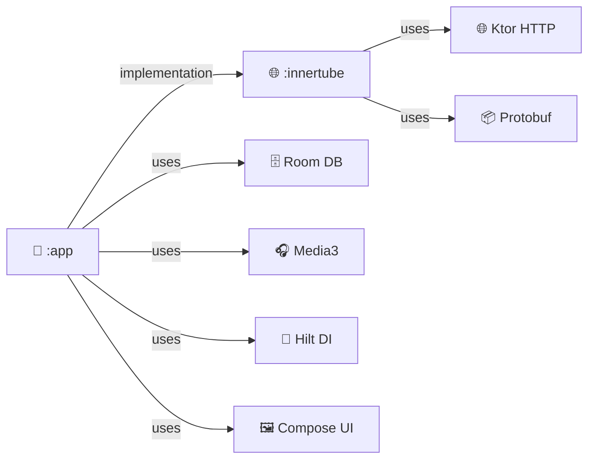

---

## File Structure

### `:app` Source Tree
```
app/src/main/kotlin/com/fiend/music/
│
├── App.kt                      ← Application class (Hilt entry point)
├── MainActivity.kt             ← Single activity, Compose host
│
├── api/                        ← External API integrations (lyrics, recognition)
├── betterlyrics/               ← BetterLyrics API models & client
│   └── models/
├── constants/                  ← App-wide constants (preferences keys, etc.)
├── db/                         ← Room database layer
│   ├── MusicDatabase.kt        ← @Database definition
│   ├── DatabaseDao.kt          ← All DAO operations (mega-DAO pattern)
│   ├── Converters.kt           ← Type converters (List<String> ↔ String)
│   ├── daos/                   ← Specialized DAOs
│   └── entities/               ← 31 Room entity data classes
│       ├── SongEntity.kt       ← Core song record
│       ├── AlbumEntity.kt
│       ├── ArtistEntity.kt
│       ├── PlaylistEntity.kt
│       ├── LyricsEntity.kt     ← Cached lyrics (LRC format)
│       ├── FormatEntity.kt     ← Cached stream format info
│       ├── Event.kt            ← Playback event log (for Stats)
│       └── ...28 more
│
├── di/                         ← Hilt dependency injection modules
├── discord/                    ← Discord Rich Presence integration
├── eq/                         ← Equalizer feature
│   ├── audio/                  ← Audio processing (parametric EQ)
│   └── data/                   ← EQ presets/state
│
├── extensions/                 ← Kotlin extension functions
├── listentogether/             ← Listen Together (co-listening via WebSocket)
├── lyrics/                     ← Lyrics fetching & parsing
├── models/                     ← UI-level data models & mappers
│
├── playback/                   ← 🎧 The core playback engine
│   ├── MusicService.kt         ← Media3 MediaLibraryService (209 KB!)
│   ├── MediaLibrarySessionCallback.kt ← Handles media button events
│   ├── PlayerConnection.kt     ← Bridge between UI and MusicService
│   ├── DownloadUtil.kt         ← Download manager
│   ├── ExoDownloadService.kt   ← Background download service
│   ├── SleepTimer.kt           ← Sleep timer logic
│   ├── StreamUrlCache.kt       ← Stream URL TTL cache
│   ├── VoiceSearchMatcher.kt   ← Voice command matching
│   ├── alarm/                  ← Alarm/reminder features
│   ├── audio/                  ← Custom audio effects processors
│   └── queues/                 ← Queue management (shuffle, smart queue)
│
├── quicksettings/              ← Android Quick Settings tile
├── recognition/                ← Song recognition (Shazam-like via ACRCloud)
├── utils/
│   └── potoken/                ← PoToken generator (YouTube bot protection)
│
├── viewmodels/                 ← 28 ViewModels (one per screen/feature)
│   ├── HomeViewModel.kt
│   ├── LyricsViewModel.kt
│   ├── StatsViewModel.kt
│   └── ...
│
├── widget/                     ← Android home screen widget
│
└── ui/
    ├── component/              ← Reusable Compose components
    │   └── shimmer/            ← Shimmer loading components
    ├── menu/                   ← Context menus (song, album, playlist, etc.)
    ├── player/                 ← Now Playing screen (full player UI)
    ├── theme/                  ← MaterialKolor dynamic theming
    ├── utils/                  ← Compose utilities
    └── screens/                ← 24+ feature screens
        ├── HomeScreen.kt       ← Main home feed (154 KB)
        ├── StatsScreen.kt      ← Listening statistics
        ├── HistoryScreen.kt
        ├── AlbumScreen.kt
        ├── ChartsScreen.kt
        ├── ListenTogetherScreen.kt
        ├── artist/             ← Artist detail & items
        ├── library/            ← Local library (songs, albums, artists, playlists)
        ├── playlist/           ← Playlist detail views
        ├── search/             ← Online & offline search
        ├── settings/           ← Full settings hierarchy
        ├── equalizer/          ← Equalizer UI
        ├── recognition/        ← Song recognition UI
        ├── podcast/            ← Podcast browsing
        └── wrapped/            ← Yearly "Wrapped" summary feature
```

### Architecture Classification
> **Pattern:** Multi-Module · Clean Architecture · MVVM  
> **Style:** Single Activity + Compose Navigation

This is a **feature-layered multi-module** architecture:
- Horizontal layers (Presentation → Domain → Data) within `:app`
- Vertical module separation between `:app` (Android) and `:innertube` (pure Kotlin)

---

## Data Flow

How data flows from YouTube's servers to the user's ears:

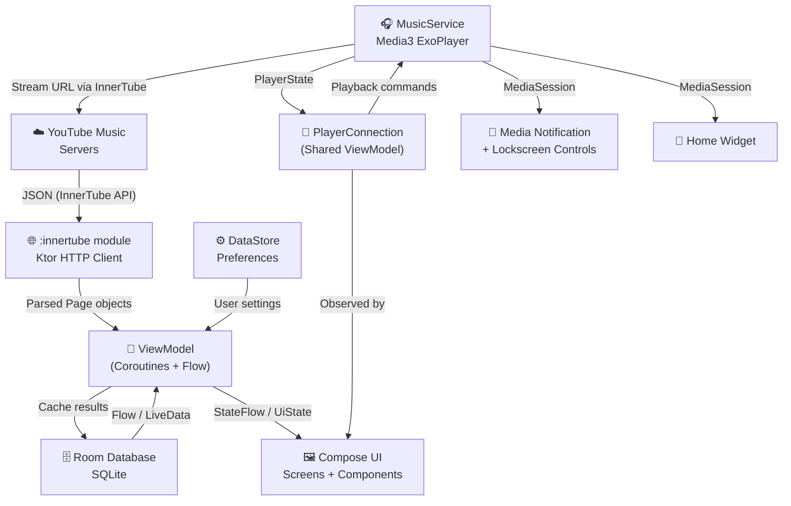

---

## App Launch Flowchart

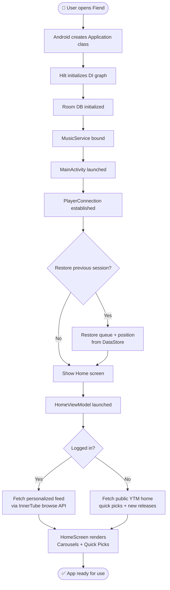

---

## Playback Workflow

The playback pipeline is the heart of Fiend. Here's exactly what happens when you tap a song:

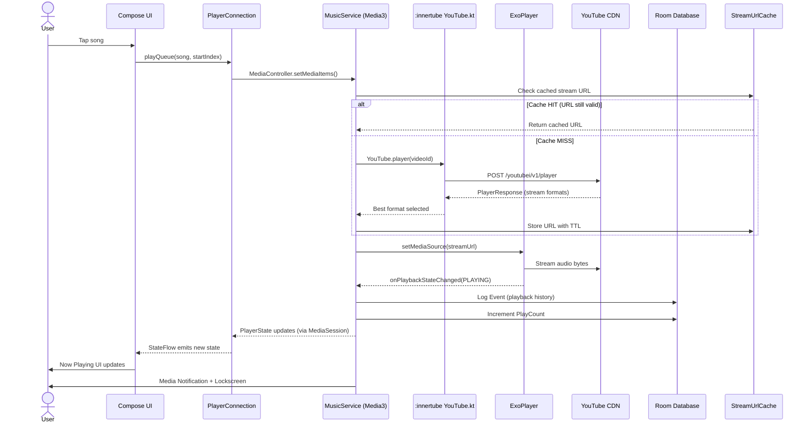

### Playback Engine Details

| Component | Role |
|---|---|
| `MusicService` | `MediaLibraryService` — the Android background service that survives app minimization |
| `MediaLibrarySessionCallback` | Handles media button commands (play/pause/next/prev/seek) from notification, lockscreen, Bluetooth, Android Auto |
| `PlayerConnection` | A `@HiltViewModel`-like shared object that all Compose screens observe to get current playback state |
| `StreamUrlCache` | Caches YouTube stream URLs with their TTL (they expire after ~6 hours) |
| `ExoDownloadService` | Downloads songs for offline playback using Media3's download manager |
| `SleepTimer` | Pauses playback after a set duration or at end of current track |

---

## InnerTube API Pipeline

Fiend communicates with YouTube Music using the private **InnerTube API** — the same API used by the official YouTube app internally. All calls go through the `:innertube` module.

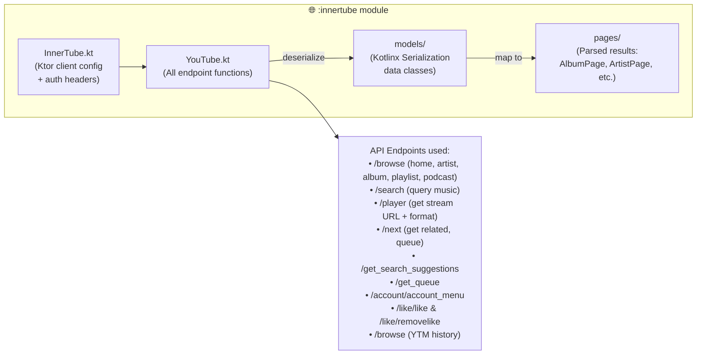

#### Key API Endpoints

| Endpoint | What it fetches |
|---|---|
| `/youtubei/v1/browse` | Home feed, Artist page, Album, Playlist, History, Podcast |
| `/youtubei/v1/search` | Search results (songs, albums, artists, videos) |
| `/youtubei/v1/player` | Stream URLs (audio formats), video metadata |
| `/youtubei/v1/next` | Related songs, "Up Next" queue |
| `/youtubei/v1/get_search_suggestions` | Search autocomplete |
| `/youtubei/v1/get_queue` | Queue from a given seed track |
| ReturnYouTubeDislike API | Dislike count display |

---

## Lyrics Pipeline

Fiend uses a **multi-source fallback chain** to find synced lyrics (LRC format) or plain text lyrics.

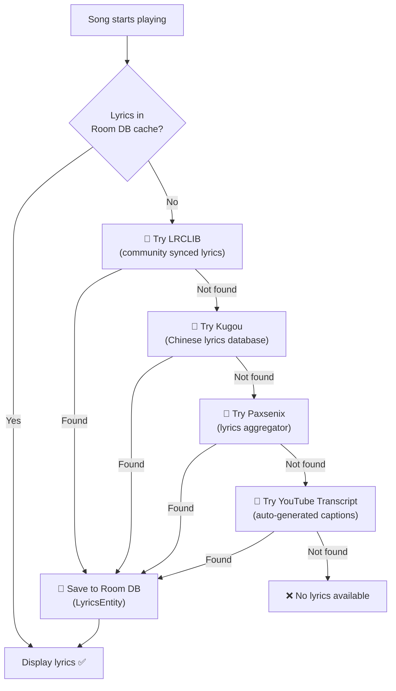

**BetterLyrics** is also integrated for enhanced synced lyrics display with word-by-word highlighting.

---

## UI Component Hierarchy

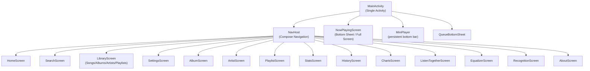

### Theme System

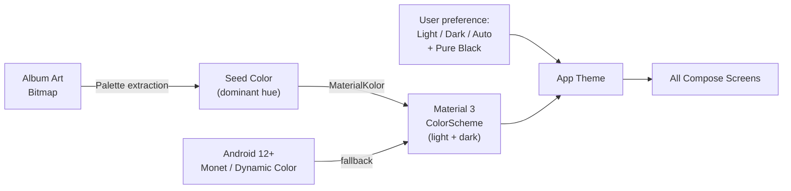

---

## Database Schema

Room database with **31 entities**. Core entities:

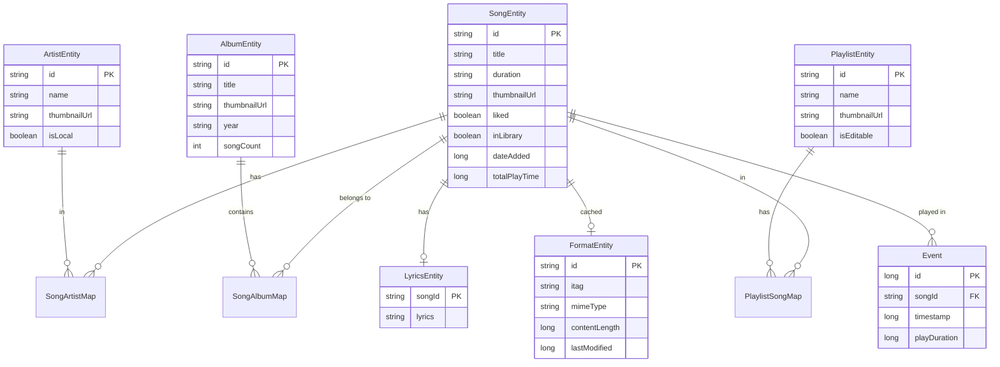

---

## Dependency Injection

Hilt modules wire everything together:

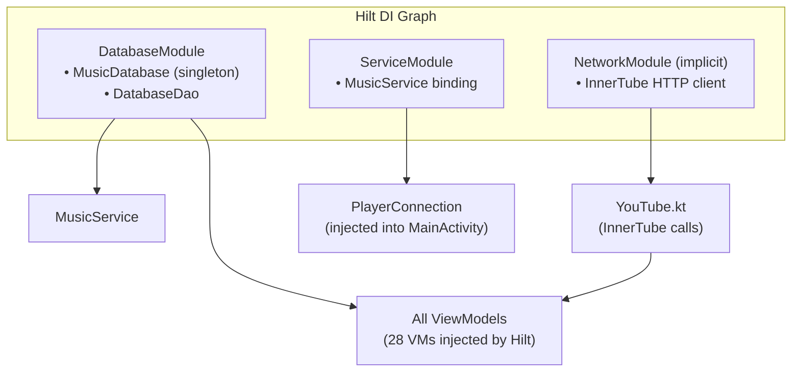

---

## Build Flavors

Fiend ships in three flavors to support different distribution channels:

| Flavor | App ID | Features | Distribution |
|---|---|---|---|
| `foss` | `com.fiend.music` | No GMS dependency, no Cast | GitHub Releases, IzzyOnDroid |
| `gms` | `com.fiend.music` | + Google Cast support | Sideload / GMS devices |
| `izzy` | `com.fiend.music` | Strict FOSS (no proprietary libs) | IzzyOnDroid F-Droid repo |

**Default build flavor:** `foss`

```bash
# Build command (FOSS debug)
./gradlew :app:assembleFossDebug

# Output APK
app/build/outputs/apk/universalFoss/debug/app-universal-foss-debug.apk
```

---

## Complete System Diagram

```mermaid
flowchart TB
    subgraph Android_Device["📱 Android Device"]
        subgraph APP["🎵 Fiend App"]
            subgraph UI_LAYER["Presentation Layer"]
                COMPOSE["Jetpack Compose\nScreens + Components"]
                VM["ViewModels\n(28 screens)"]
            end
            
            subgraph DATA_LAYER["Data Layer"]
                ROOM["Room DB\n(31 entities)"]
                DS_PREFS["DataStore\n(Preferences)"]
            end
            
            subgraph SERVICE["Background Service"]
                MS["MusicService\n(Media3 MediaLibraryService)"]
                EXO["ExoPlayer\n(audio engine)"]
                DL["DownloadManager\n(offline cache)"]
            end

            subgraph INNERTUBE_MOD["🌐 :innertube module"]
                KTOR["Ktor 3 HTTP Client\n(OkHttp engine)"]
                SERIAL["Kotlinx Serialization\n(JSON parsing)"]
            end
        end

        NOTIF["🔔 Media Notification"]
        LOCK["🔒 Lockscreen Controls"]
        WIDGET["🏠 Home Widget"]
        QS["⚡ Quick Settings Tile"]
        AUTO["🚗 Android Auto"]
    end

    subgraph Cloud["☁️ Internet"]
        YTM_API["YouTube InnerTube API\n(music.youtube.com)"]
        YT_CDN["YouTube CDN\n(audio streams)"]
        LYRICS_LRCLIB["LRCLIB\n(synced lyrics)"]
        LYRICS_KUGOU["Kugou\n(lyrics)"]
        LYRICS_PAX["Paxsenix\n(lyrics)"]
        DISCORD_API["Discord API\n(Rich Presence)"]
        RYD["ReturnYouTubeDislike\n(dislikes)"]
        SHAZAM["ACRCloud\n(recognition)"]
    end

    COMPOSE <-->|"StateFlow / events"| VM
    VM <-->|"Suspend fns / Flow"| ROOM
    VM <-->|"Suspend fns / Flow"| DS_PREFS
    VM <-->|"suspend API calls"| KTOR
    KTOR <-->|"HTTPS POST"| YTM_API
    MS <-->|"Stream URL"| YTM_API
    EXO <-->|"Audio bytes"| YT_CDN
    MS -->|"MediaSession"| NOTIF
    MS -->|"MediaSession"| LOCK
    MS -->|"MediaSession"| WIDGET
    MS -->|"MediaSession"| QS
    MS -->|"MediaBrowser"| AUTO
    VM -->|"lyrics fetch"| LYRICS_LRCLIB
    VM -->|"fallback"| LYRICS_KUGOU
    VM -->|"fallback"| LYRICS_PAX
    VM -->|"Rich Presence"| DISCORD_API
    VM -->|"dislike counts"| RYD
    VM -->|"song recognition"| SHAZAM
    SERIAL <-->|"parse"| KTOR
```

---

*Generated by Antigravity · Fiend v1.0.0 · © 2025 Dhruv Saraswat / Eurt-labs*
